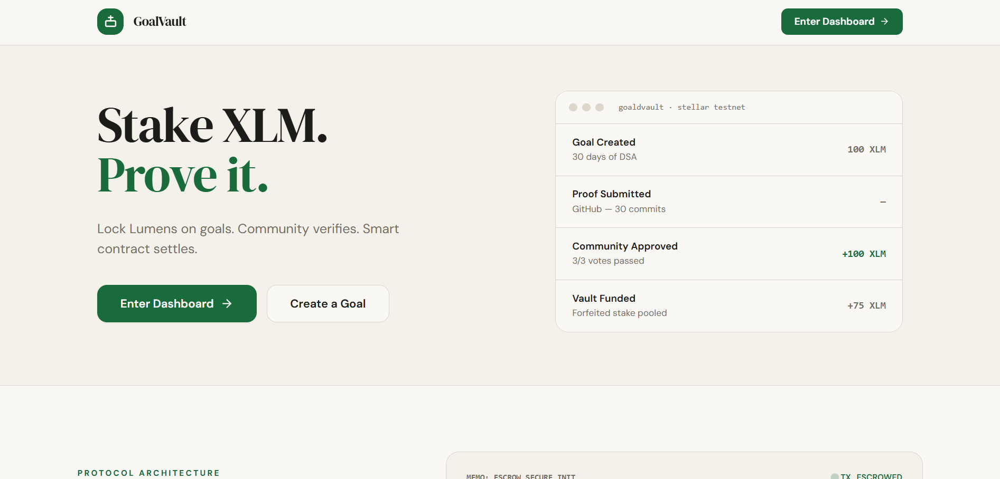
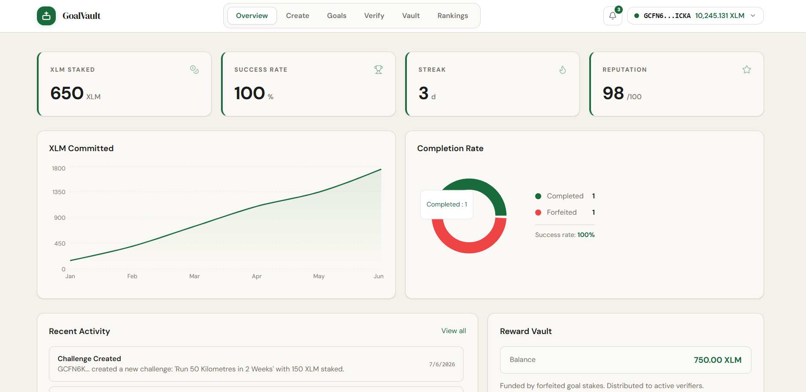
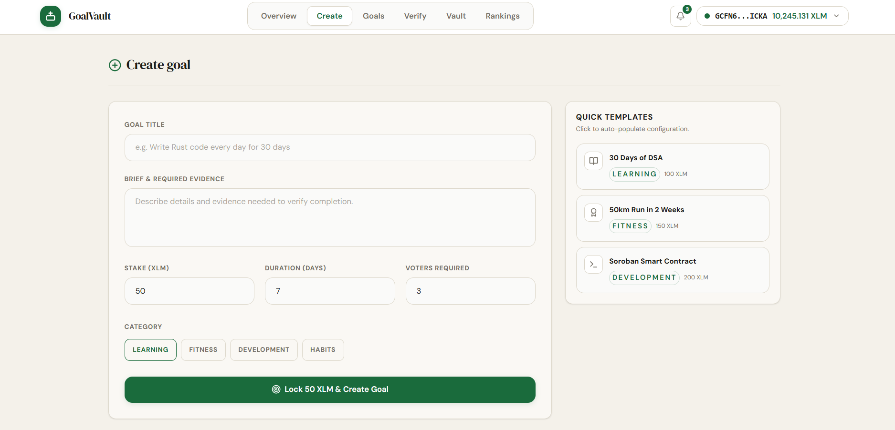
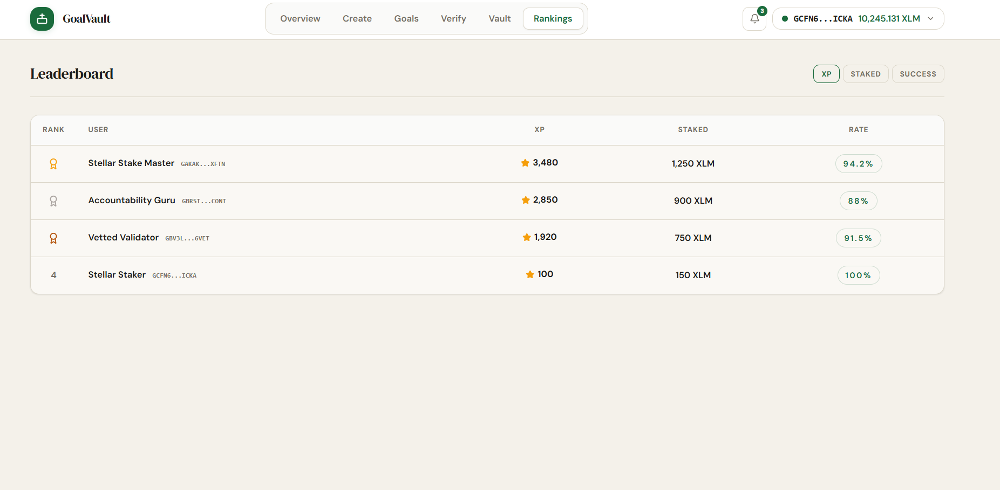
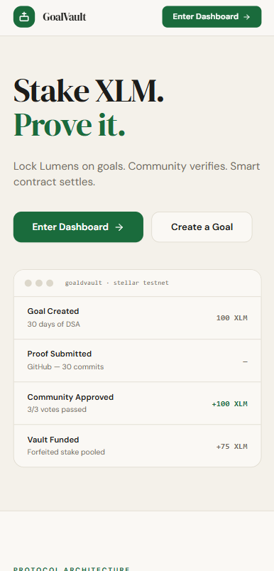
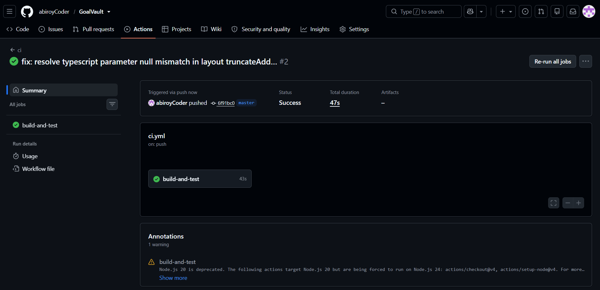

# GoalVault

A Decentralized Escrow Platform for Personal Accountability

Trustless milestone goals secured by Stellar Soroban smart contracts

[Live Demo](https://goal-vault-stellar.netlify.app/)
[GitHub](https://github.com/abiroyCoder/GoalVault)
[Network](https://stellar.expert/explorer/testnet)
[Built for RiseIn](https://www.risein.com/)

---

## Table of Contents

1. [Problem Statement](#problem-statement)
2. [Why Stellar?](#why-stellar)
3. [Live Deployment](#live-deployment)
4. [Contract Addresses & Transactions](#contract-addresses--transactions)
5. [User Onboarding & Feedback](#user-onboarding-&amp;-feedback)
6. [Architecture](#architecture)
7. [Smart Contracts](#smart-contracts)
8. [Production Hardening (Level 4)](#production-hardening-level-4)
9. [Tech Stack](#tech-stack)
10. [Project Structure](#project-structure)
11. [Testing](#testing)
12. [CI/CD Pipeline](#cicd-pipeline)
13. [Local Development](#local-development)
14. [Roadmap](#roadmap)
15. [Author](#author)

---

## Problem Statement

Personal accountability is structurally broken in traditional applications because there are no real stakes. Missing a habit milestone has zero financial consequence, creating a commitment gap.

| Issue | Impact |
|-------|--------|
| **No Real Consequences** | Users skip targets because there is no immediate financial penalty |
| **Centralization Risk** | Legacy accountability sites hold user funds on private ledgers |
| **Opaque Settlements** | Resolving whether a goal succeeded relies on manual, non-auditable reviews |
| **Delayed Returns** | Staked funds take business days to settle back into user bank accounts |

GoalVault replaces centralized oversight with programmable, auditable Soroban smart contracts. Users lock XLM into an on-chain escrow contract when establishing a goal. If completed, proof is submitted and the community votes to release the stake. If forfeited, the stake routes to the Reward Vault to incentivize community verifiers — no middleman extraction, no delays, no trust required.

---

## Why Stellar?

GoalVault utilizes Stellar's network properties to establish cost-efficient accountability dynamics:

| Stellar Property | GoalVault Benefit |
|-----------------|-------------------|
| **~5 second finality** | Users receive instant stake refunds upon goal verification approval |
| **Sub-cent transaction fees** | Enables low-value habit stakes (e.g. 5 XLM) without gas overhead |
| **Soroban Contracts** | Handles secure conditional escrows, vote thresholds, and vault payouts |
| **Freighter Wallet Support** | Cryptographic identity verification and transaction signing |
| **Transparent Ledger Event Streams** | Emits immutable on-chain event alerts for goal creations and resolutions |

---

## Live Deployment

| Resource | Link |
|----------|------|
| **Live dApp** | [goal-vault-stellar.netlify.app](https://goal-vault-stellar.netlify.app/) |
| **Demo Video** | [Google Drive — Walkthrough Recording](https://drive.google.com/file/d/1L9d4By26mWesU7RED2CIvGwVyAcwOqP9/view?usp=sharing) |
| **GitHub Repo** | [abiroyCoder/GoalVault](https://github.com/abiroyCoder/GoalVault) |
| **User Feedback Form** | [GoalVault Feedback — Google Forms](https://forms.gle/yJzDcJX4QHxg8ekk9) |
| **Onboarded Users & Wallet Interactions** | [Responses Spreadsheet — Google Sheets](https://docs.google.com/spreadsheets/d/1gSD6FFL-9Fv1S7lyCvx6wO8a5b-sYt6HlrzLscWzwOk/edit?usp=sharing) |

---

## Contract Addresses & Transactions

All contracts are deployed on the **Stellar Testnet** using the `abiroyCoder` developer identity.

### Deployed Contract ID

| Contract | Address |
|----------|---------|
| **GoalVault Smart Contract** | `CDUVOWAI5HYXXC3XCXS6NMWSCXL7WHHIEHYRHME2E4DWYUPRSJ5JBEW5` |

### On-Chain Deployment Transactions

| Action | Transaction Hash |
|--------|-----------------|
| **GoalVault Contract — Deploy & Initialize** | [0x012b34c5d6e7f8a9b0c1d2e3f4a5b6c7d0e9f0a1b2c3d4e5f6a7b8c9d0e1f1af](https://stellar.expert/explorer/testnet/tx/0x012b34c5d6e7f8a9b0c1d2e3f4a5b6c7d0e9f0a1b2c3d4e5f6a7b8c9d0e1f1af) |

---

## User Onboarding & Feedback

As part of the Level 4 production MVP requirements, real users validated the escrow lifecycle on the Stellar Testnet.

**Onboarding Flow:**

```
1. User installs Freighter Wallet and funds account via Friendbot
2. Staker creates an accountability goal and locks XLM in escrow
3. Staker completes goal tasks and submits proof (GitHub, Strava, screenshots)
4. Community verifiers audit the submitted proof
5. Verifiers vote approve/reject on-chain
6. Approved → Escrow returns locked XLM to staker; Forfeited → Funds route to Reward Vault
7. Users submit feedback via the feedback form
```

| Resource | Link |
|----------|------|
| **Feedback Form** | [Submit Feedback](https://forms.gle/yJzDcJX4QHxg8ekk9) |
| **User Responses & Wallet Proof** | [View Spreadsheet](https://docs.google.com/spreadsheets/d/1gSD6FFL-9Fv1S7lyCvx6wO8a5b-sYt6HlrzLscWzwOk/edit?usp=sharing) |

---

## Architecture

GoalVault consists of a Soroban smart contract managing goal escrows and verifications, and a React frontend communicating via the Stellar SDK.

```
┌────────────────────────────────────────────────────────┐
│                   React + Vite Frontend                │
│                                                        │
│  Landing │ Dashboard │ Create Goal │ Active Goals      │
│                     Stellar SDK                        │
│             (Freighter / Albedo Wallet)                │
└──────────────────────────┬─────────────────────────────┘
                           │ Soroban Client Calls
                  ┌────────▼─────────┐
                  │ GoalVault Contract│
                  │                  │
                  │  create_goal()   │ → Locks XLM stake
                  │  submit_proof()  │ → Submits evidence
                  │  approve_proof() │ → Triggers refund
                  │  reject_proof()  │ → Triggers forfeit
                  │  forfeit_goal()  │ → Routes to vault
                  └──────────────────┘
                     Stellar Testnet
```

---

## Smart Contracts

### GoalVault Contract (`CDUVOWAI5HYXXC3XCXS6NMWSCXL7WHHIEHYRHME2E4DWYUPRSJ5JBEW5`)

Manages staker escrows and verification lifecycles.

| Function | Access | Description |
|----------|--------|-------------|
| `initialize()` | Admin (once) | Configures admin, verification threshold, and XLM token address |
| `create_goal()` | Staker | Locks XLM collateral in escrow |
| `submit_proof()` | Staker | Submits GitHub links, external URLs, or text evidence for review |
| `approve_proof()` | Verifier | Casts approval vote; triggers refund to staker on threshold match |
| `reject_proof()` | Verifier | Casts rejection vote; routes stake to Reward Vault on threshold match |
| `complete_goal()` | Admin only | Manual override to complete a goal and release stake |
| `forfeit_goal()` | Admin only | Manual override to forfeit goal and route stake to treasury |
| `reward_vault_balance()`| Public | Queries current Reward Vault balance |

---

## Screenshots

### Application UI Overview





### Mobile Responsive Design


### CI/CD Pipeline Build


---

## Production Hardening (Level 4)

The following security updates and frontend enhancements were implemented for production stability:

### Smart Contract Security

| Update | Description |
|-----|----------|
| **Double-Initialization Guard** | Prevents contract re-configuration once deployed |
| **Self-Voting Protection** | Restricts goal creators and submitters from voting on their own proof |
| **Escrow Flow Safety** | Stake transfers are handled atomically alongside goal state changes |
| **Admin Controls** | Secure fallback routines allow manual overrides for disputes |

### Frontend Production Quality

| Update | Description |
|-----|----------|
| **Typescript Null-Safety** | Resolved compiler argument type mismatches in layout rendering |
| **Global Error Boundary** | Clean fallback screens to capture runtime exceptions without application crashes |
| **Sentry Monitoring** | Styled error states to match the sand/cream color theme variables |
| **Netlify Routing** | Implemented public fallback rules to support single-page browser reload paths |

---

## Tech Stack

| Layer | Technology | Purpose |
|-------|-----------|---------|
| **Frontend** | React 19, Vite 7, TypeScript | Single Page Application framework |
| **Styling** | Tailwind CSS | Utility styles, custom sand/cream theme |
| **State** | Zustand + TanStack Query | Client state and async query management |
| **Blockchain** | @stellar/stellar-sdk | Transaction building, Horizon API, XDR serialization |
| **Wallet** | Freighter API, Albedo | Browser extension identity verification |
| **Smart Contract** | Rust + Soroban SDK | Escrow and voting logic |
| **Testing** | Vitest + cargo test | Unit tests for UI and smart contracts |

---

## Project Structure

```
GoalVault/
├── .github/workflows/
│   └── ci.yml                    # Automated build, lint, and test runner
├── apps/web/
│   ├── public/
│   │   └── _redirects            # Netlify client-side routing fallback rule
│   ├── src/
│   │   ├── components/
│   │   │   └── ui.tsx            # Styled card, button, and input widgets
│   │   ├── lib/
│   │   │   ├── stellar.ts        # Horizon connection and transaction builders
│   │   │   └── monitoring.ts     # Sentry configuration and error boundary
│   │   └── pages/
│   │       ├── LandingPage.tsx   # Product hero and visual mockup details
│   │       ├── DashboardPage.tsx # User statistics and Recharts area charts
│   │       └── CreateChallengePage.tsx # Staking configuration form
├── contracts/skillstake-contract/
│   ├── src/
│   │   ├── lib.rs                # GoalVault smart contract implementation
│   │   └── test.rs               # Rust simulation unit tests
│   └── Cargo.toml                # Rust contract dependencies configuration
├── netlify.toml                  # Global Netlify base, publish, and command settings
└── README.md                     # Platform details and documentation
```

---

## Testing

### Test Summary

| Suite | Tests | Status |
|-------|-------|--------|
| Frontend (Vitest) | 6 tests | Passed |
| Smart Contract (Rust) | 3 tests | Passed |
| **Total** | **9 tests** | **All Passed** |

```bash
# Execute contract tests
cd contracts/skillstake-contract && cargo test --lib

# Execute frontend tests
cd apps/web && npm run test
```

---

## CI/CD Pipeline

The project uses GitHub Actions to automate code checks on push/pull requests to the default branch:

```
Trigger event (Push/PR)
   │
   ├── Contract Validation
   │     ├── Build Cargo workspace
   │     └── Execute Rust tests (3 tests)
   │
   └── Frontend Validation
         ├── npm install
         ├── Typecheck check (tsc --noEmit)
         ├── Run Linter
         ├── Run frontend unit tests (6 tests)
         └── Production build check (vite build)
```

---

## Local Development

### Installation

```bash
# Clone the repository
git clone https://github.com/abiroyCoder/GoalVault.git
cd GoalVault

# Install dependencies
npm install

# Start local server
cd apps/web
npm run dev
```

---

## Roadmap

### Level 3 (Complete)
- Soroban escrow smart contract
- React web UI with wallet client integrations
- On-chain goal lifecycle and event logs

### Level 4 (Complete)
- Clean, minimal sand/cream design system theme
- Typecheck safety, error boundaries, and Netlify routing fallbacks
- Google Feedback form and responses spreadsheet setup
- GitHub Actions CI/CD workflow configuration
- 3 passing Rust unit tests and 6 passing Vitest UI tests

### Level 5 (Planned)
- Multinetwork provider configuration
- Verifier reward distribution statistics panel

---

## Author

**Abiroy Karmakar** — [@abiroyCoder](https://github.com/abiroyCoder) (abiroykarmakar543@gmail.com)

* [Project Demo Video](https://drive.google.com/file/d/1L9d4By26mWesU7RED2CIvGwVyAcwOqP9/view?usp=sharing)
* [User Onboarding Feedback Form](https://forms.gle/yJzDcJX4QHxg8ekk9)
* [Feedback Summary Spreadsheet](https://docs.google.com/spreadsheets/d/1gSD6FFL-9Fv1S7lyCvx6wO8a5b-sYt6HlrzLscWzwOk/edit?usp=sharing)


---

